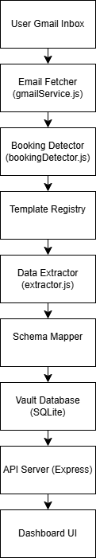
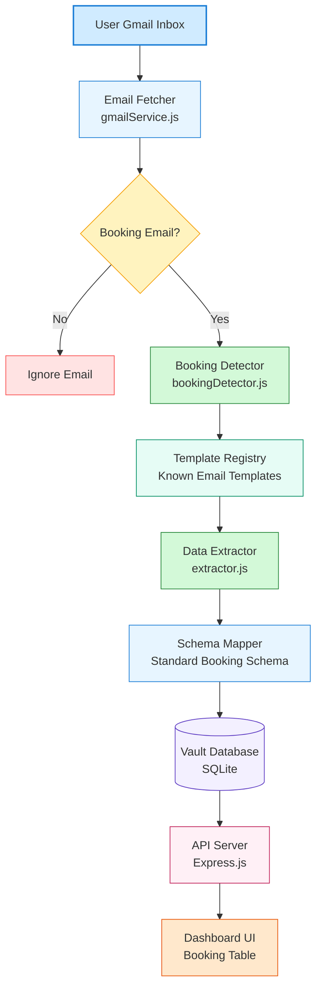

# 📧 Email Booking Data Extraction System

## Overview

The **Email Booking Data Extraction System** is designed to automatically process booking-related emails and extract important travel information such as **Passenger Name, PNR, Booking ID, and reservation details**.

The system detects booking confirmation emails, extracts relevant data using rule-based parsing, converts the extracted information into a **standardized schema**, and stores it in a **secure vault database** for easy retrieval through a dashboard interface.

The architecture is designed to be **scalable, privacy-conscious, and cost-efficient**, minimizing repeated AI processing by maintaining a **template registry** for known email formats.


## Project Preview

Below is the architecture of the system used to process booking emails.



---

# Tech Stack

### Backend

* **Node.js**
* **Express.js**

### Database

* **SQLite**

### Frontend

* **HTML**
* **JavaScript**

### Tools

* **VS Code**
* **Draw.io**
* **GitHub**

---

# System Workflow

The system processes emails through a structured pipeline that detects booking confirmations, extracts relevant information, and stores it in a structured vault.



---

# Architecture Diagram

A high-level architecture diagram of the system is available here:

```
diagrams/architecture.png
```

The architecture represents a **modular pipeline** where each component performs a specific task in the email processing flow.

---

# Project Structure

```
email-booking-system
│
├── backend
│   ├── server.js
│   ├── gmailService.js
│   ├── bookingDetector.js
│   ├── extractor.js
│   ├── emailProcessor.js
│   └── database.js
│
├── frontend
│   └── index.html
│
├── schemas
│   ├── flightSchema.json
│   └── hotelSchema.json
│
├── templates
│   └── templateRegistry.js
│
├── diagrams
│   └── architecture.png
│
├── README.md
└── vault.db
```

---

# System Components

### 1️⃣ Email Fetcher

Responsible for retrieving emails from the user's inbox.
For demonstration purposes, the system currently simulates emails using `gmailService.js`.

### 2️⃣ Booking Detector

Analyzes email content and determines whether the email contains booking-related information using keyword matching.

### 3️⃣ Template Registry

Stores mappings for known email providers to avoid repeated processing or AI calls for common templates.

### 4️⃣ Data Extractor

Extracts structured booking information such as:

* Passenger Name
* PNR
* Booking ID

using pattern-based parsing.

### 5️⃣ Schema Mapper

Converts extracted information into a standardized schema structure for consistent storage.

### 6️⃣ Vault Database

Stores extracted booking information securely in a **SQLite database**.

### 7️⃣ Dashboard UI

Displays stored bookings through a simple frontend dashboard.

---

# How the System Works

1. The system fetches emails from the inbox.
2. Each email is analyzed to determine whether it contains booking information.
3. Known email formats are matched using the **Template Registry**.
4. Booking details are extracted using pattern matching.
5. Extracted information is converted into a **structured schema**.
6. The structured data is stored in the **vault database**.
7. The backend API serves booking data.
8. The dashboard displays the booking information.

---

# Edge Cases Considered

The system is designed to handle several real-world scenarios:

* Missing booking ID or PNR
* Multiple passengers in a single booking email
* Duplicate booking emails
* Unknown email templates
* Partial booking information
* Booking details present in attachments

---

# Scalability Approach

To minimize operational costs and improve efficiency:

* The system maintains a **Template Registry** for known email providers.
* Known templates are processed without invoking external AI systems.
* Only unknown formats would require AI-assisted processing in future improvements.

This hybrid approach ensures:

* lower cost
* faster processing
* improved scalability

---

# Future Improvements

Potential extensions to enhance the system include:

* Real Gmail API integration
* PDF attachment parsing for ticket extraction
* AI-assisted template detection for unknown email formats
* Notification system for newly detected bookings
* User authentication and multi-user vault support

---

# Conclusion

This project demonstrates a scalable approach for **automated email booking extraction**, combining structured data processing, template-based parsing, and modular architecture to efficiently organize booking information from emails.
